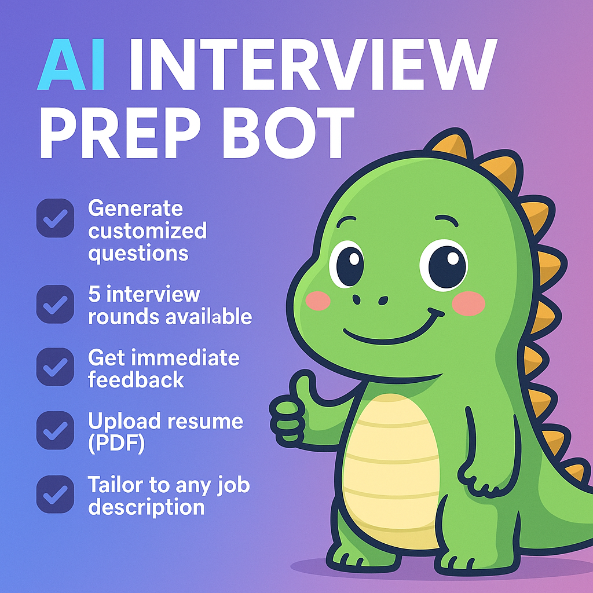

# 🦕 Dino AI Interview Prep Bot

A powerful Streamlit app that helps students and professionals **prepare for interviews** with AI-generated questions tailored to their **resume** and **job description**. Supports 5 interview rounds with detailed feedback, answer evaluation, and scoring!

## 🚀 Live Demo

🌐 [Click here to try the app](https://interview-prep-bot-dino999.streamlit.app)

## 🎯 Features

- 📄 Upload your **Resume (PDF)**  
- 📌 Optionally add **Job Description**
- 🎯 Choose from 5 Interview Rounds:
  - HR
  - Technical Theory
  - Technical MCQ
  - Aptitude + Verbal
  - Logical Reasoning
- ❓ AI-generated Questions (Tailored to your resume & JD)
- 🧠 Feedback on your answers (HR & Theory)
- ✅ MCQ Auto-grading with Explanation
- 📊 Tracks Daily Usage & Score
- 🌈 Clean, gradient UI with branding: *“Prepare with Dino”*

---

## 🛠️ Tech Stack

| Component        | Technology Used             |
|------------------|-----------------------------|
| App Framework    | [Streamlit](https://streamlit.io) |
| LLM Backend      | [Groq API (LLaMA3-70B)](https://groq.com) |
| PDF Parsing      | `PyMuPDF` (`fitz`)          |
| LLM Integration  | LangChain (`ChatGroq`, `LLMChain`) |
| Hosting          | [Streamlit Cloud](https://streamlit.io/cloud) |
| Version Control  | Git + GitHub                |

---

## 📁 Project Structure
├── app.py                 # Main Streamlit app
├── requirements.txt       # Python dependencies
├── .gitignore
├── streamlit/
│   └── secrets.toml       # API keys (not committed)
└── banner-image.png       # Optional banner for repo
Pull requests are welcome! If you have feedback or want to add features, feel free to fork the repo.

🙌 Credits
Developed by Narsing Dinesh Reddy
👨‍🎓 B.Tech – Artificial Intelligence and Data Science
📫 LinkedIn:https://www.linkedin.com/in/dinesh-reddy-narsing-918b23255/ 

🏁 Future Enhancements
✅ Resume-based job recommendations
✅ Voice-based Q&A
✅ Admin dashboard for usage analytics
✅ User login and history tracking

✨ “Prepare smart. Interview like a pro. With Dino.” ✨
